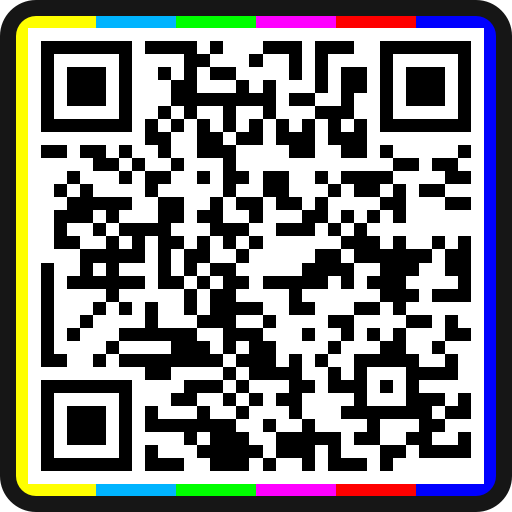

# [VBML](README.md) VidéoTag

## [english](../VideoTag.md) / français

Un VidéoTag est un QR code personnalisé qui contient du texte [VBML](https://omega.gg/VBML/fr). Il
peut être intégré au sein d'une frame vidéo rendant possible la navigation entre les tracks et les
playlists.

Il est basé sur du texte et repose sur un [Lecteur Sémantique](https://omega.gg/about/SemanticPlayer/fr)
pour récupérer les données brutes. En conséquence, il peut contenir plusieurs jours de contenu
vidéo compressés dans un seul VideoTag. Il est aussi efficient pour partger du contenu dans divers
scénarios.

## Projets en relation

- [MotionBox](https://omega.gg/MotionBox/sources) - Navigateur Vidéo
- [MotionMonkey](https://omega.gg/MotionMonkey/fr) - Lecteur Sémantique
- [tévolution](https://omega.gg/tevolution/fr) - Écran Vidéo Déporté

## Documents

## Auteurs

- Benjamin Arnaud alias [bunjee](https://bunjee.me/fr) | <bunjee@omega.gg>
