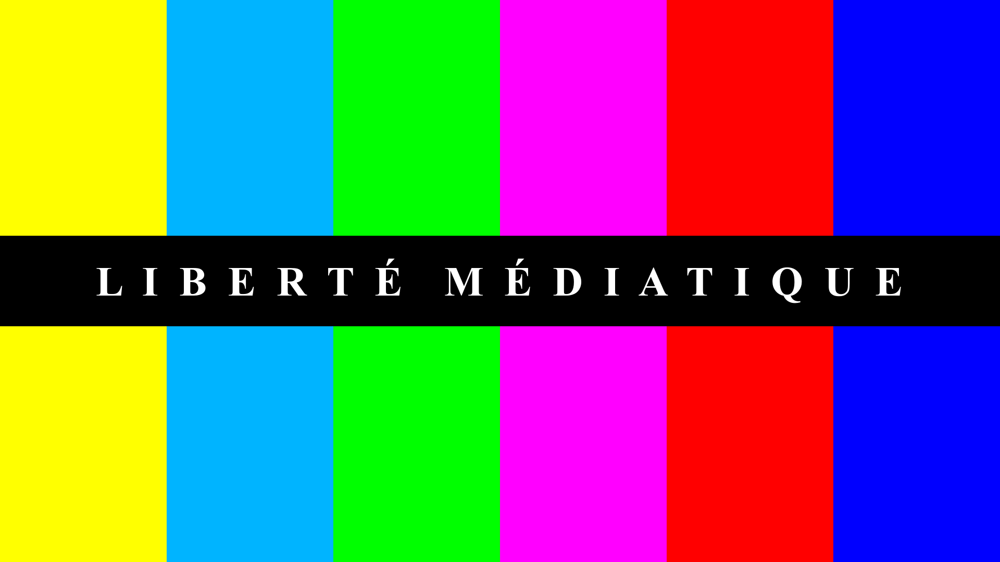

# [VBML](README.md) Éthique

## Liberté Médiatique

La Liberté Médiatique est un ensemble de principes concernant la lecture vidéo sur Internet. Ces
principes fondamentaux sont implémentés dans les outilis logiciels désireux d'innover dans cette
direction:

- La liberté d'accéder aux ressources vidéo sur Internet
- La liberté d'organiser des sources vidéo décentralisées
- La liberté de partager des contenus vidéo avec le monde entier

### La liberté d'accéder

La liberté d'accéder signifie que l'utilisateur doit être en mesure d'accéder aux ressources vidéo
sans intermédiaire entre le logiciel client et la donnée. En d'autres termes, chaque octet de la
ressource doit être accessible directement sur le serveur distant. C'est appliquable aux sources
vidéo ainsi qu'aux ressources liées comme les métadonnées ou les sous-titres.

### La liberté d'organiser

La liberté d'organiser signifie que l'utilisateur doit être en mesure d'agencer les sources vidéo
comme il le souhaite. Par exemple, il doit être capable de créer des Playlist(s) ou des Feed(s)
avec des sources vidéo décentralisées en provenance de différents serveurs Internet. Ce qui permet
d'effectuer une curation sur ce qu'il juge important ou non selon sa propre sensibilité.

### La liberté de partager

La liberté de partager signifie que l'utilisateur doit être en mesure de partager le contenu vidéo
avec le monde entier. Que ce soit une source vidéo ou un ensemble de vidéos comme une Playlist ou
un Feed, l'utilisateur doit être en mesure de partager ces ressources de personne a personne,
universellement et sans l'intervention d'une entité tierce.

## Projets en relation

- [MotionBox](https://omega.gg/MotionBox/sources) - Navigateur Vidéo
- [MotionMonkey](https://omega.gg/MotionMonkey/fr) - Lecteur Sémantique
- [tevolution](https://omega.gg/tevolution/fr) - Écran Vidéo Déporté

## Documents

## Auteurs

- Benjamin Arnaud alias [bunjee](https://bunjee.me/fr) | <bunjee@omega.gg>
